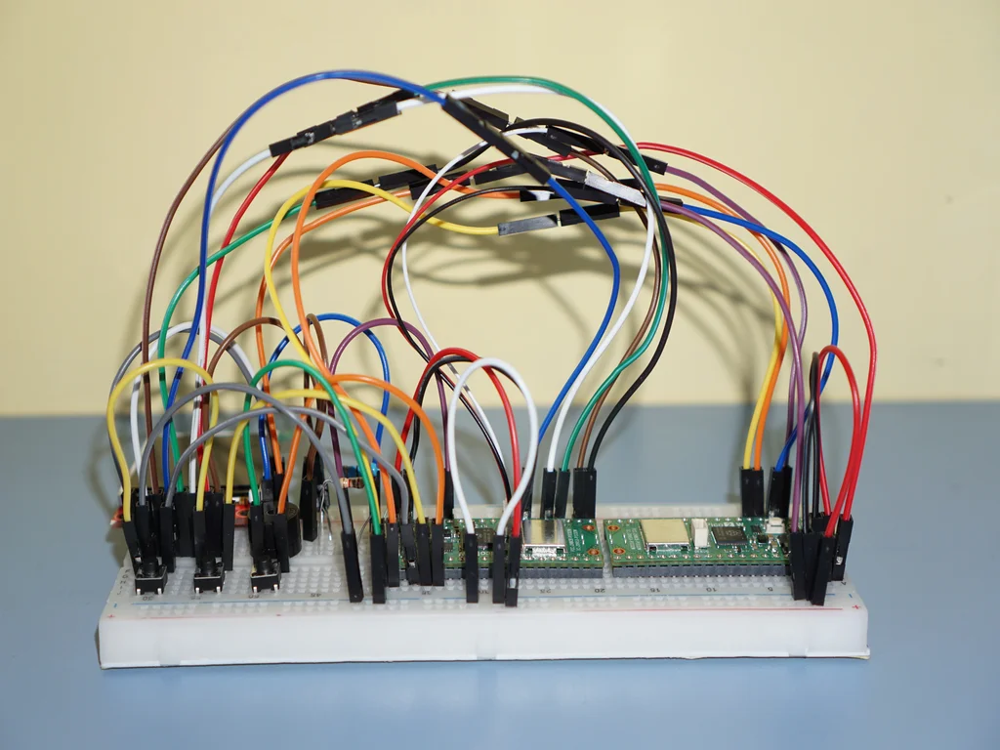
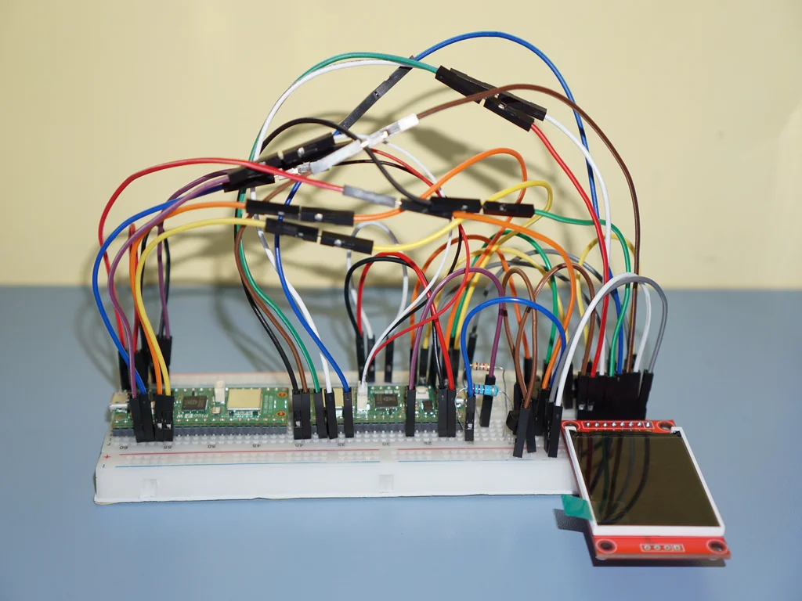

# Bluetooth Distance Tracker
A Bluetooth based system that estimates how far your phone is and makes a sound if it goes too far away.

:::info 

**Author**: Timofte Andrei-Ioan \
**GitHub Project Link**: [Github](https://github.com/UPB-PMRust-Students/proiect-Andrei1223)

:::

## Description

This is a device that continuously measures, in real time, the distance between a Raspberry Pi Pico and a specific device that has Bluetooth.
It scans only for whitelisted devices identified by a predefined unique identifier, reads the RSSI(Received Signal Strength Indicator) to estimate the distance, and shows the value on a small TFT LCD.
With three onboard buttons, the user can set a custom distance limit. If the tracked device moves beyond that limit, the system makes a sound using a passive buzzer.
Such a tool is useful for keeping personal belongings nearby or simplifying indoor localization.

## Motivation

The motivation is my passion and curiosity about what Bluetooth Low Energy can achieve drove me to explore distance estimation based on RSSI.

I want to:
 - understand the practical limits of RSSI-based ranging
 - design a self-contained tracker and to learn Rust's embedded ecosystem while building something genuinely useful for everyday life

## Architecture

The system is composed of these main components:

**1. Raspberry Pi Pico 2W**

It does most of the computing and scanning for Bluetooth devices.
Embassy's async executor multiplexes three tasks: scanning, UI and alerts. The RP2350's second core is unused.

**2. BLE Scanner**

Filters advertisements to a single device ID and retrieves its RSSI once per scan.
It is a software task that runs the CYW43439 modem as an observer and does:
 - periodically issues scan requests(every 500 ms)
 - maintains a list of devices(target MAC or UUID) and discards all other advertisements
 - for each accepted packet, timestamps and stores raw RSSI in a buffer
 - publishes the buffered RSSI samples to the Distance Estimator over an async channel

**3. Distance Estimator**

Converts the RSSI stream into a single, smoothed distance value:
 - at first boot the user will record `RSSI0` at a known distance `d0 = 1 m`
 - uses the log-distance equation `d = 10^((RSSI0 − RSSI) / (10 x n))`, where n is the environment-specific path-loss exponent (default 1.8 indoors)
 - a constant velocity Kalman smoother removes fast fades and outputs the distance every 250 ms

**4. Buttons**

Three tactile buttons used by the user to control the sound and threshold distance. The buttons are used to
control the menu that is displayed onto the LCD screen.

**5. Display Driver**

SPI driver for an ST7735 1.8" TFT using the `st7789` crate.
 - Shows a numeric distance (in metres with one decimal) for the current device.
 - Shows a bar for the current sound level.

**6. Alert Handler**

 Generates a PWM sound on a passive buzzer whenever the measured distance is greater than the limit.

## Log

### Week 5 - 11 May
Setting up the framework to run a Raspberry Pi Pico 2W with another MCU as the debugger. Researching for methods to communicate with another device via BLE in Embassy. Acquired all the components needed for this project.

### Week 12 - 18 May
Connected all the components and tested that the buttons can controll the passive buzzer. Also connected the LCD and started working on the menu options and wrote the software in order to controll the buzzer and the LCD. Started working on the software to receive Bluetooth signals.

### Week 19 - 25 May
TODO

## Hardware

The tracker is minimalist and everything fits on a breadboard and runs from a single Micro USB supply.
The only active electronics are:
 - the Raspberry Pi Pico 2W which brings the RP2350 MCU
 - the CYW43439 Wi-Fi/BLE modem and a 1.8" SPI TFT for the user interface
 - three tactile buttons that let you control the menu
 - a passive buzzer that provides the sound alert

Aside from wires, resistors, diodes and transistors, no additional sensors or wireless modules are required.  Distance estimation relies solely on the RSSI that the on-board BLE modem already outputs.

### Schematics

### Images

### Bill of Materials

| Device | Usage | Price |
|--------|--------|-------|
| [Raspberry Pi Pico 2W](https://www.raspberrypi.com/documentation/microcontrollers/raspberry-pi-pico.html) | The microcontroller | [2x35 RON](https://www.optimusdigital.ro/en/raspberry-pi-boards/12394-raspberry-pi-pico-w.html) |
| [Display TFT LCD 1.8"](https://www.displayfuture.com/Display/datasheet/controller/ST7735.pdf) | To display the map and menu  | [34 RON](https://www.emag.ro/display-tft-lcd-1-8-inch-128x160-spi-st7735s-arduino-emg204/pd/D8RPFSYBM/) |
| [Passive Buzzer](https://components101.com/sites/default/files/component_datasheet/Buzzer%20Datasheet.pdf) | For emitting sounds | [2 RON](https://www.optimusdigital.ro/ro/audio-buzzere/634-buzzer-pasiv-de-5-v.html?search_query=buzzer+pasiv&results=15) |
| [10 Male to male wires](https://media.digikey.com/pdf/Data%20Sheets/Digi-Key%20PDFs/Jumper_Wire_Kits.pdf) | Wires | [2x5 RON](https://www.optimusdigital.ro/ro/fire-fire-mufate/884-set-fire-tata-tata-40p-10-cm.html?search_query=Fire+Colorate+Tata-Tata+%2840p%2C+10+cm%29&results=10) |
| Buttons | For user input | [3x0.36 RON](https://www.optimusdigital.ro/en/buttons-and-switches/1119-6x6x6-push-button.html?search_query=buttons&results=258) |
| Resistors, transistors | For connecting the components | 2 RON |

## Software

| Library | Description | Usage |
|---------|-------------|-------|
| [st7789](https://github.com/almindor/st7789) | Display driver for ST7789 | Used for the display for the Pico Explorer Base |
| [embadded-hal](https://docs.rs/embedded-hal/latest/embedded_hal/) | Hardware Abstraction Layer | Used to control the SPI and GPIO |
| [pwm](https://docs.rs/rp2040-hal/latest/rp2040_hal/pwm/index.html) | Pulse width modulation| For controlling the passive buzzer |
| [embassy-rp](https://docs.embassy.dev/embassy-rp/git/rp2040/index.html) | RP2350 support crates | Used for initializing and interacting with peripherals |
| [embedded-graphics](https://github.com/embedded-graphics/embedded-graphics) | 2D graphics library | Used for drawing to the display |
| [cyw43](https://crates.io/crates/cyw43) | Bluetooth/WiFi library | Used to activate the CYW43439 chip| 
| [trouble_host](https://docs.embassy.dev/trouble-host/git/default/index.html)| BLE Host | Used for creating a host and receiving BLE signals |
| [embedded-kalman](https://crates.io/crates/embedded-kalman) | Kalman filtering | Used for smoothing RSSI before distance computing |

## Links

<!-- Add a few links that inspired you and that you think you will use for your project -->

1. [CYW43439 Wifi/BLE](https://pmrust.pages.upb.ro/docs/acs_cc/lab/07#wi-fi-in-embassy)
2. [SPI with screen](https://pmrust.pages.upb.ro/docs/acs_cc/lab/05#screen)
3. [GPIO](https://pmrust.pages.upb.ro/docs/acs_cc/lab/02)
